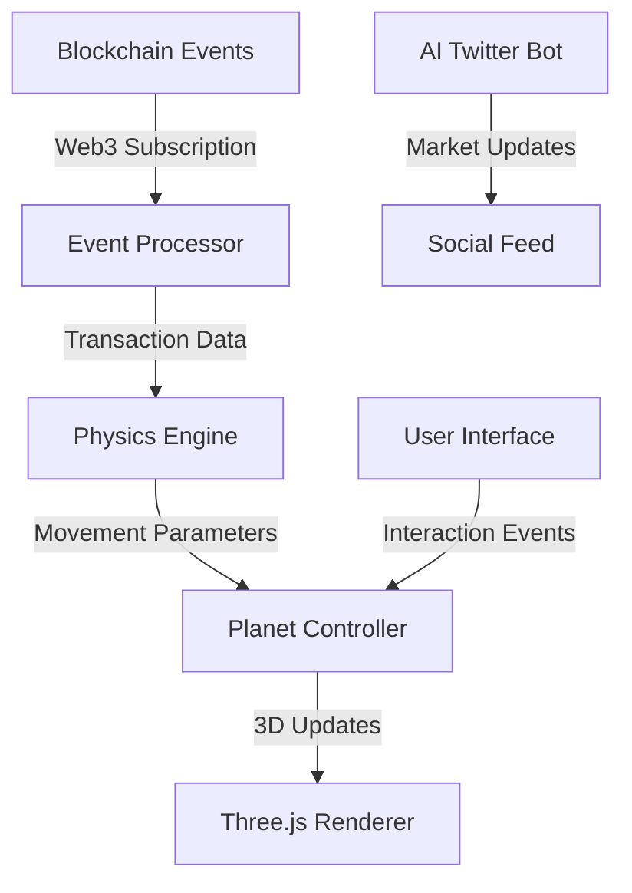

<div align="center">

# 🌌 COSMOS


### Where Blockchain Meets the Universe

[](https://github.com/cosmos/cosmos/stargazers)
[](https://twitter.com/cosmos)
[](https://opensource.org/licenses/MIT)

[Explore Demo](http://your-demo-link.com) • [Documentation](http://your-docs-link.com) • [Twitter Bot](http://twitter.com/your-bot) • [Join Community](http://your-community-link.com)

</div>

---

## 🎯 Overview

COSMOS transforms blockchain transactions into celestial movements, creating a living, breathing visualization of market dynamics. Watch as planets dance to the rhythm of trades, turning complex market data into an intuitive cosmic display.

## 🌟 Key Features

### Real-time Celestial Mechanics
- **Transaction-Driven Movement**: Each blockchain transaction triggers unique planetary animations
- **Dynamic Orbital Patterns**: Planet velocities and trajectories adapt to:
  - Transaction volume
  - Trade size
  - Market momentum
- **Interactive 3D Rendering**: Powered by Three.js for smooth astronomical visualizations

### Blockchain Integration
- **Web3 Architecture**:
  ```javascript
  const cosmosEngine = {
    web3Provider: window.ethereum,
    contractAddress: "0x...",
    networkId: 1, // Ethereum Mainnet
    wsProvider: new Web3.providers.WebsocketProvider(WS_ENDPOINT)
  };
  ```
- **Event Subscription System**:
  ```javascript
  // Transaction event listener
  contractInstance.events.Transfer({
    fromBlock: 'latest'
  })
  .on('data', event => {
    updateCelestialBodies(event.returnValues);
  });
  ```

### Technical Architecture



### Planet Movement System
```typescript
interface PlanetaryBody {
  position: Vector3;
  velocity: Vector3;
  mass: number;
  orbitRadius: number;
  rotationSpeed: number;
}

class CelestialSystem {
  private bodies: Map<string, PlanetaryBody>;
  
  updatePositions(transaction: TransactionEvent): void {
    const impactFactor = calculateImpact(transaction.value);
    this.bodies.forEach(body => {
      body.velocity.add(
        new Vector3()
          .randomDirection()
          .multiplyScalar(impactFactor)
      );
    });
  }
}
```

## 🛠️ Technology Stack

- **Frontend**:
  - Three.js for 3D rendering
  - React for UI components
  - Web3.js for blockchain integration
  - TailwindCSS for styling

- **Blockchain**:
  - Ethereum Smart Contracts
  - WebSocket providers for real-time updates
  - MetaMask integration

- **AI Integration**:
  - Twitter Bot running on Node.js
  - NLP for cosmic-themed market analysis

## 📊 Performance Optimization

- WebGL-based rendering for smooth animations
- Efficient blockchain event filtering
- Optimized 3D models and textures
- Web Worker implementation for physics calculations

```javascript
// Web Worker for physics calculations
const physicsWorker = new Worker('physics.worker.js');

physicsWorker.postMessage({
  type: 'UPDATE_POSITIONS',
  data: currentPositions
});

physicsWorker.onmessage = (e) => {
  updateScene(e.data.newPositions);
};
```

## 🚀 Quick Start

1. **Clone and Install**
```bash
git clone https://github.com/your-username/cosmos.git
cd cosmos
npm install
```

2. **Configure Environment**
```bash
cp .env.example .env
# Add your Web3 provider and contract details
```

3. **Start Development Server**
```bash
npm run dev
# Visit http://localhost:3000
```

## 🔮 Future Enhancements

- Neural network integration for predictive movements
- Advanced market pattern recognition
- VR support for immersive experience
- Cross-chain support
- Enhanced particle effects for special events

## 🌟 Contributing

We love contributions! See our [Contribution Guidelines](CONTRIBUTING.md) for details.

<div align="center">

## 🌌 Join the Cosmic Revolution

[Website](http://your-website.com) • [Twitter](http://twitter.com/your-handle) • [Discord](http://discord.gg/your-server) • [Telegram](http://t.me/your-group)

</div>
