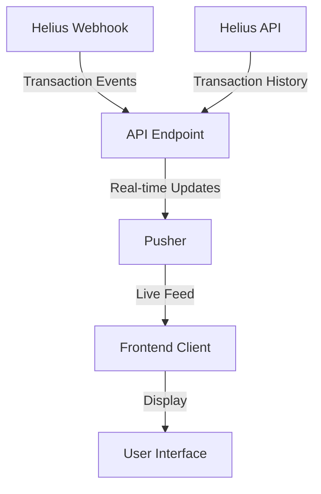

<div align="center">

# 🌌 COSMOS


### Where Blockchain Meets the Universe

[](https://github.com/TheCosmosWorld/cosmos-world/stargazers)
[](https://opensource.org/licenses/MIT)

[Explore](https://cosmosworld.io/) • [Documentation](http://your-docs-link.com) • [Join Community](http://your-community-link.com)

</div>

---

## 🎯 Overview

COSMOS transforms blockchain transactions into celestial movements, creating a living, breathing visualization of market dynamics. Watch as planets dance to the rhythm of trades, turning complex market data into an intuitive cosmic display.

## 🌟 Key Features

### Real-time Transaction Tracking
- **Webhook Integration**: Real-time transaction updates via Helius API
- **Live Updates**: Instant transaction notifications using Pusher
- **Transaction History**: Comprehensive view of past transactions
- **Responsive UI**: Beautiful and intuitive interface

### Technical Architecture



## 🛠️ Technology Stack

- **Frontend**:
  - Next.js for the application framework
  - React for UI components
  - TailwindCSS for styling
  - Pusher for real-time updates

- **Backend**:
  - Next.js API routes
  - Helius API for blockchain data
  - Pusher for WebSocket communication

## 📊 Features

- Real-time transaction monitoring
- Transaction history with filtering
- Beautiful UI with dark mode
- Responsive design
- Efficient caching system
- Error handling and retry mechanisms

## 🚀 Quick Start

1. **Clone and Install**
```bash
git clone https://github.com/TheCosmosWorld/cosmos-world.git
cd cosmos-world
npm install
```

2. **Configure Environment**
```bash
cp .env.example .env
# Add your Helius API key and Pusher credentials
```

3. **Start Development Server**
```bash
npm run dev
# Visit http://localhost:3000
```

## 🔮 Future Enhancements

- Enhanced transaction analytics
- More detailed transaction information
- Advanced filtering options
- Transaction search functionality
- Export capabilities

## 🌟 Contributing

We love contributions! Please feel free to submit a Pull Request.

## 📝 License

This project is licensed under the MIT License - see the [LICENSE](LICENSE) file for details.

## 🚀 Deployment

The easiest way to deploy your Next.js app is to use the [Vercel Platform](https://vercel.com/new) from the creators of Next.js.

Check out the [Next.js deployment documentation](https://nextjs.org/docs/pages/building-your-application/deploying) for more details.

<div align="center">

## 🌌 Join the Cosmic Revolution

[Website](http://your-website.com) • [GitHub](https://github.com/TheCosmosWorld/cosmos-world)

</div>
